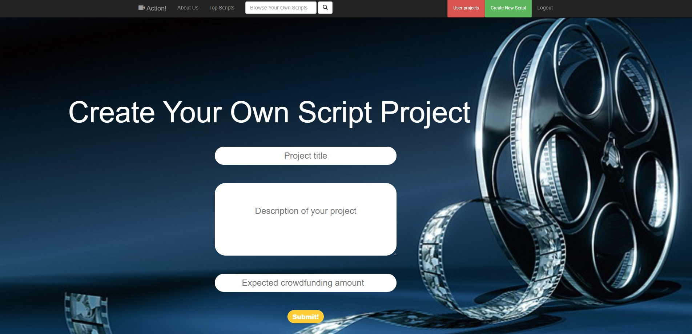

<div align="center">
  
</div>

---

**Action!**  is an online script writing editor and script inspiration sharing community web app based on Node.js and Python. The app provides efficient script repository and easy-to-use script editor as the basic function. The main killer app idea is a brand new script version control system and image imagination system. Action! not only means action in a film scene, but also means the action script writers take behind the scene.

## Installation

Action! is currently host on Goorm.io, an online Node.js IDE, require the latest Node.js enivronment and NPM installation as well.

To initialize Action! execution, all the JSON dependency should be installed.
```bash
npm install express --save
npm install express-session --save
npm install ejs --save
npm install passport passport-local passport-local-mongoose --save
npm install share --save
npm install redis --save
npm install body-parser --save
```

You can also install based on the package.json dependencies in source code.

```bash
"dependencies": {
    "body-parser": "^1.19.0",
    "browserchannel": "^2.1.0",
    "ejs": "^3.0.2",
    "express": "^4.17.1",
    "express-session": "^1.17.1",
    "mongoose": "^5.9.9",
    "passport": "^0.4.1",
    "passport-local": "^1.0.0",
    "passport-local-mongoose": "^6.0.1",
    "redis": "^3.0.2",
    "share": "^0.6.3"
  }
```

To use the image imagination function in Action!, you also need to install Python  to setup environment. 
```bash
pip install numpy scipy
pip install scikit-learn
pip install pillow
pip install h5py
pip install tensorflow
pip install keras
pip install tqdm
```

Or you can run the following code to install python dependencies(requirement.txt is in /py).
```bash
- run "pip3 install -r requirements.txt"
```

After installation, open your node terminal and launch mongoDB

```bash
mongod
```

To run the server file and launch Action!

``` bash
node app.js
``` 

If no error occurs, you have successfully installed Action!.

Action! is run on localhost:3000 by default. To change the port, modify the system environment varible in app.js.

## Why Action?
- Secure repository
  - Unlike traditional paper-based script writing, all the script and user information are stored in digital data base.
  - In this way, all the data and information are well protected and easy to recover. 

- Simple script editing
  - With online script editing, it is easy to edit and submit the raw script. Moreover, this editor is accostomed to script editing.
  - It removes the preview window, mode switcher, syntax symbols of markdown source code, and all other unnecessary distractions. 
  - Instead, it provides a real live preview feature to help you concentrate on the content itself.

- Intelligent image imagination
  - With the help of neural network and computer vision, the search engine of Action! is enhanced. 
  - Now, users can not only search a movie by its name but also by its poster. 
  - It is most useful in scenarios when users try to find a movie but forget its name.

- Powerful version control
  - When a script writer upload a script, all users who are interested in it can edit and submit their own version. 
  - After the approval from project administrators, a new version of this script is created.
  - Howerver, a newer version will not replace but succeed as a branch of the older version.
  - Therefore, all the versions of a script will construct a tree, with the original version as its root.
  - This version tree maintains the independence of each version while preserves their relevance.
  - Thus, the version tree is a powerful tool to store and manage all the versions.

## Quick Start

There is the full document of Action! app.

#### Sign Up and Login
- Sign Up
  - When you visit Action! home at the first time, you will be asked to login, and click the button below the checkbox to go to the sign up page to create a new user profile.
<div align="center">
  
</div>

- Login
  - Everytime you access Action!, you need to login to access database to browse scripts.
<div align="center">
  
</div>

#### Create a project
- Create New Project
  - You can create a project after login Action!, click the CREATE button on the app navbar, name your project then set a sound crowdfunding amount for it.
<div align="center">
  
</div>

- Access the first version
  - After creation, the app will auto redirect to the first version of the script.

#### Script Editing
- Markdown Panel
  - In the panel, the editor is fully support Markdown.io and has been added more features such as chapter mark and line mark due to script requirement. You can follow the tutorial at the bottom of the panel.
<div align="center">
  
</div>

#### Version Control
- Version forward and recursive
  - After each version is submitted, the version tree will be renewed to another tree level. And the current branch will have a new copy. The owner or the administrator of the project can manage the current version by using version forward and version recursive button on the version control panel.
<div align="center">
  
</div>

- Branch split
  - While you editing a branch which another contributor already edited, the system will send a request to the owner or administrator for you. The admin can choose which user to share the working branch.
<div align="center">
  
</div>

#### Image Imagination
- Image Tag
  - While project creation the system will ask the contributor to upload the poster of the script, and the system will automatically parse the project name then tag the project poster and save it into database.
<div align="center">
  
</div>

- Imagination
  - If someone want to find a project, using a vague impression, s/he can use the general description like "a man with sword" to search for a project.
<div align="center">
  
</div>

- About Imagination
  - Our model includes faster rcnn ,which use restnet50 as the backbone network, and seq2seq model with attention assisted to encode the language with feature map. In our project, since the poster itself always impressed people better than the name of the movie/script. So we want to propose a function to enable the user to search the movie by their vague impression like in the movie poster – brave heart which has some attributes like “a man with sword”, “muscle”, “ strong man”, we want to label the poster but human label is very complex and needs huge human resource. In our model we can use many frequently query or hot search words to query the given poster, if the credential score is extremely high, say around 0.95, then we can build a poster to tag relation shape to store in database, so that later users can use the tag, basically the natural language to find out the corresponding movie/script.

## Documentation
#### Database maintenance
All the user data is stored in actionWeb database in mongoDB.
- To retrieve user data, access users collection.
- To retrieve project data, access projects collection.
- To retrieve version data, access versions collection.
- To retrieve comment data, access comment collection.

#### Image Imagination Data source
Because the lack of user data, we use third party tagged data set to test the image imagination function. The data is stored in p_dataset database in mongoDB.

## Contributing

Action! is still under development. More sound functions and features are going to be added and we always welcome contributions to help make Action! better. If you would like to contribute, please check out tjxia@engineer.com

## TODO
- APIs for image imagination
- front-end styling
- crowdfunding system

## Citing Action!

If you find Action! useful, please cite it in your reference.

```latex
@misc{actionWeb,
  author = {Tianjian Xia, Jiayang Liu, Yang Gan, Peng Zhang, Minhao Chen, Zheng Shi},
  title = {Action},
  year = {2020},
  reposit = {goorm.io}
}
```

## Acknowledgment

Action! was previously a crowdfunding community based on java Spring Boot. You can check out tjxia@engineer.com for more detail. Many thanks to Jiayang Liu and Yang Gan's pioneering work for Action! before first version.

We would like to thank Syracuse University EECS Department and Professor Yu for providing such an excellent project opportunity.